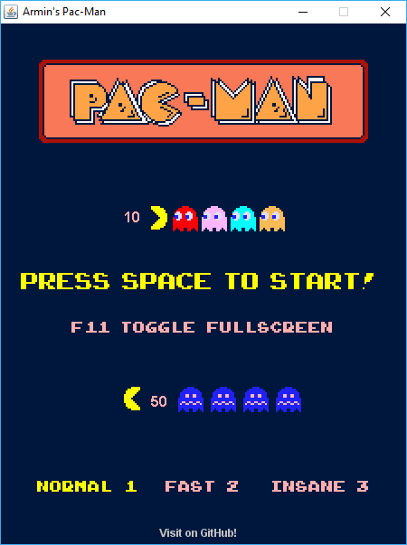
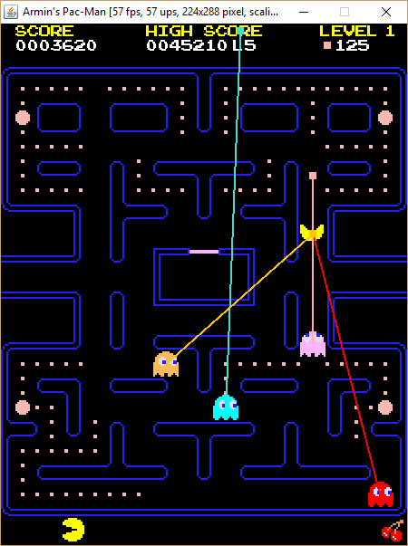
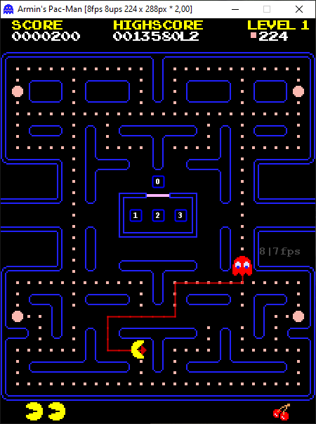
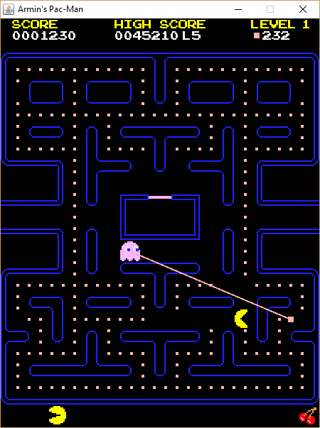
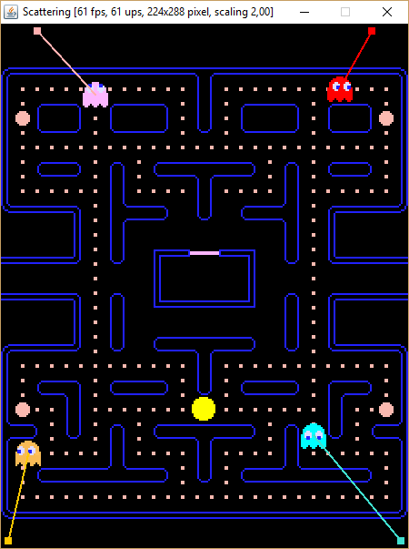

# A comprehensible(?) Pac-Man implementation        



## Pac-Man? Really? How uncool!

For the average school kid in 2018, a retro game like Pac-Man probably seems like the most boring and uncool thing you can deal with. These cool kids implement their own 3D shooters with real and unreal engines in less than a week, don't they?

Well, some of them probably even can do that (I can't). But I think that for many young people with an interest in computer programming also a simple (?) old-school game like Pac-Man can be very instructive. And for me personally, it brings back  memories because the only computer game I played regularly was ["Snack Attack"](https://www.youtube.com/watch?v=ivAZkuBbpsM), then running on my Apple II compatible computer in 1984. On a green monitor, no colors. But what a sound!

Note: If you are the kind of kid that just wants to write quick and dirty code, this is not the right place for you. Also, if you are somebody who doesn't start with less than a game engine like Unity for implementing Pac-Man. I want to address people with an interest in writing code instead of using tools.
   
## The challenge
For a beginner in programming, a game like Pac-Man can be interesting for different reasons. First, it isn't as trivial as "Pong" for example. Programming "Pong" is surely a good start. Programming a game loop, updating and drawing paddles, ball movement, collisions with walls and paddles are good stuff for starters. The next step probably are "Breakout" variants with different kinds of targets, waves, levels, special balls and so on. 

Pac-Man offers new challenges. First, the representation of the maze and the correct movement of the characters in the maze is not trivial. The Pac-Man is moved through the maze using the keyboard and you can press the key for the intended direction before he reaches the position where he actually can change his direction. You can and should spend some time to get this (sufficiently) right.

Another task are the animations, timers and the rendering of Pac-Man and the four ghosts. You have to deal with sprites and different kinds of animations. It's a good exercise to implement all that from the ground up instead of just using predefined tools.

If you have mastered these basics and your actors can move correctly through the maze, you are challenged with making the "real" game. You have to think about what different phases (states) the game can have, how the actors and the user interface behave in these states and which "events" lead from one state to the other (state transitions).

Maybe you should start with a single ghost and implement its behavior: waiting in the ghost house, jumping, leaving the house and chasing Pac-Man. Next, what should happen when Pac-Man and a ghost are colliding? Which part of your program should coordinate this? Should the code be distributed over the actors or should you have some kind of mediator, some central game control? Where should the game rules (points, lives, levels etc.) be implemented? Just where you need it or in a central place, a *model* in the sense of the Model-View-Controller pattern?

You may think that this is overengineering for such a simple program, but just have a look at some of the implementations you can find on the internet, read the code and judge if you really enjoy it. Can you learn how that game works from code where the game state is distributed in global variables, timers, flags and the game rules are distributed over the actors? 

Without thinking about all these issues and having an idea how to structure it, your code can quickly become a real mess. Probably you will get some parts running quickly but when it comes to the interaction between the different actors, the game state and the timing, you can easily lose ground. 

## Searching for help

And then you will look for help on the internet. You look at game "tutorials" on YouTube but they just tell you to put the right code in your entities' "update" method, add a few variables and flags here and there, write a few if- and switch-statements and all will be well and running. 

Or you will look into the code of others who have implemented Pac-Man, often with impressive results, for example see [here](https://github.com/leonardo-ono/Java2DPacmanGame) or [here](https://github.com/yichen0831/Pacman_libGdx). But when your look into the code, you are either overwhelmed or you understand only some parts but do not get the whole picture. Even if concepts like state machines are used in their code, they are not written in a way that helps you to understand the complete working of the game. From a practical point this is completely ok, often the underlying concepts somehow melt into the implementation and can only be recognized later if you have an idea what the implementor was trying to do. But often too, the concepts are only realized half-way or abandoned during the implementation to get the thing finally running.

And then you maybe become totally frustrated and lose interest. Or you give it a last try and search the internet again. And you will find articles about using state machines in games in general and also in the Pac-Man game. You will find introductory computer science courses on AI where Pac-Man is used as a test ground for implementing AI agents. This is certainly very interesting but it doesn't help you with your own Pac-Man implementation because these agents are programmed against some predefined Pac-Man framework and cannot be 1:1 used inside your own game. And it doesn't help you with the control of the overall game play too.

## State machines to the rescue

You will maybe read tutorials about *(finite) state machines* and the different possibilities of implementing them: from basic switch-statements, function pointers (C, C++) to object-oriented "state pattern"-based implementations. There are also ready-to-use libraries like [Appcelerate](http://www.appccelerate.com/), [Stateless4j](https://github.com/oxo42/stateless4j) or [Squirrel](http://hekailiang.github.io/squirrel/). What should you do? 

The low-level implementations using switch-statements or function pointers (if your programming language supports this) are the most performant ones but as long a you achieve the performance goals for your game (60 frames/updates per second) you can use whatever you like. Of course, using  a higher-level implementation should make your code more readable and easier to maintain.

I decided to write my own [state machine implementation](https://github.com/armin-reichert/statemachine), which was a good exercise and really fun because of the availability of lambda expressions and method references.

After you have decided which implementation you want to use for your state machines you can finally focus on the game itself.

Which entities in the Pac-Man game are candidates for getting controlled by state machines?

Of course, Pac-Man and the four ghosts, but also the global game control, maybe also the screen selection logic or even simpler entities in your game. It is interesting to look at your program parts through the state machine glasses and find out where an explicit state machine becomes useful.

In the provided implementation, there are the following explicit state machines:
- Game controller ([PacManGameController](PacManGame/src/de/amr/games/pacman/controller/PacManGameController.java))
- Ghost attack controller ([GhostAttackTimer](PacManGame/src/de/amr/games/pacman/controller/GhostAttackTimer.java))
- Pac-Man controller ([Pac-Man](PacManGame/src/de/amr/games/pacman/actor/PacMan.java))
- Ghost controller ([Ghost](PacManGame/src/de/amr/games/pacman/actor/Ghost.java))
- Intro view controller ([IntroView](PacManGame/src/de/amr/games/pacman/view/intro/IntroView.java))

The state machines are "implemented" in a declarative way (*builder pattern*). In essence, you write a single large expression representing the complete state graph together with node and edge annotations (actions, conditions, event conditions, timers).

Lambda expressions (anonymous functions) and function references allow to embed code directly inside the state machine definition. However, if the code becomes more complex it is of course possible to delegate to separate methods or classes. Both variants are used here.

## State machines in practice

Sounds all well and nice, but how does that look in the real code? 

The intro view shows some animations that have to be coordinated using timers and stop conditions. This
is an obvious candidate for using a state machine. This state machine has no events but only uses timers,
so we specify *Void* as event type. The states are identified by numbers:

```java
.beginStateMachine()
	.description("[Intro]")
	.initialState(0)
	.states()

		.state(0)
			// Scroll logo into view
			.onEntry(() -> { show(logo); logo.start(); })
			.onExit(() -> logo.stop())

		.state(1)
			// Show ghosts chasing Pac-Man and vice-versa
			.onEntry(() -> {
				show(chasePacMan, chaseGhosts);
				start(chasePacMan, chaseGhosts);
			})
			.onExit(() -> {
				stop(chasePacMan, chaseGhosts);
				chasePacMan.tf.centerX(width);
			})
			
		.state(2)
			// Show ghost points animation and blinking text
			.timeoutAfter(() -> app().clock.sec(6))
			.onEntry(() -> {
				show(ghostPoints, pressSpace, f11Hint, visitGitHub);
				ghostPoints.start();
			})
			.onExit(() -> {
				ghostPoints.stop();
				hide(ghostPoints, pressSpace);
			})
			
		.state(42)
			
	.transitions()
		.when(0).then(1).condition(() -> logo.isCompleted())
		.when(1).then(2).condition(() -> chasePacMan.isCompleted() && chaseGhosts.isCompleted())
		.when(2).then(1).onTimeout()
		.when(2).then(42).condition(() -> Keyboard.keyPressedOnce(KeyEvent.VK_SPACE))

.endStateMachine();
```

A more complex state machine is used for defining the global game control. It processes game events which
are created during the game play, for example when Pac-Man finds food or meets ghosts. Also the different
game states like changing the level or the dying animations of Pac-Man and the ghosts are controlled by this
state machine. Further, the individual states are implemented by subclasses of the generic state class. This
has the advantage that actions which are state-specific can be realized as methods of the subclass.

```java
.beginStateMachine()
	
	.description("[Game]")
	.initialState(INTRO)
	
	.states()
		
		.state(INTRO)
			.onEntry(() -> {
				setCurrentView(getIntroView());
				THEME.snd_insertCoin().play();
			})
		
		.state(READY)
			.impl(new ReadyState())
		
		.state(PLAYING)
			.impl(new PlayingState())
		
		.state(CHANGING_LEVEL)
			.impl(new ChangingLevelState())
			.timeoutAfter(game::getLevelChangingTime)
		
		.state(GHOST_DYING)
			.impl(new GhostDyingState())
			.timeoutAfter(game::getGhostDyingTime)
		
		.state(PACMAN_DYING)
			.impl(new PacManDyingState())
		
		.state(GAME_OVER)
			.impl(new GameOverState())

	.transitions()
	
		.when(INTRO).then(READY)
			.condition(() -> introView.isComplete())
			.act(() -> setCurrentView(getPlayView()))
		
		.when(READY).then(PLAYING).onTimeout()
			
		.stay(PLAYING)
			.on(StartChasingEvent.class)
			.act(playingState()::onStartChasing)
			
		.stay(PLAYING)
			.on(StartScatteringEvent.class)
			.act(playingState()::onStartScattering)
			
		.stay(PLAYING)
			.on(FoodFoundEvent.class)
			.act(playingState()::onFoodFound)
			
		.stay(PLAYING)
			.on(BonusFoundEvent.class)
			.act(playingState()::onBonusFound)
			
		.stay(PLAYING)
			.on(PacManGhostCollisionEvent.class)
			.act(playingState()::onPacManGhostCollision)
			
		.stay(PLAYING)
			.on(PacManGainsPowerEvent.class)
			.act(playingState()::onPacManGainsPower)
			
		.stay(PLAYING)
			.on(PacManGettingWeakerEvent.class)
			.act(playingState()::onPacManGettingWeaker)
			
		.stay(PLAYING)
			.on(PacManLostPowerEvent.class)
			.act(playingState()::onPacManLostPower)
	
		.when(PLAYING).then(GHOST_DYING)
			.on(GhostKilledEvent.class)
			.act(playingState()::onGhostKilled)
			
		.when(PLAYING).then(PACMAN_DYING)
			.on(PacManKilledEvent.class)
			.act(playingState()::onPacManKilled)
			
		.when(PLAYING).then(CHANGING_LEVEL)
			.on(LevelCompletedEvent.class)
			
		.when(CHANGING_LEVEL).then(PLAYING)
			.onTimeout()
			
		.stay(CHANGING_LEVEL)
			.on(PacManGettingWeakerEvent.class)
	
		.stay(GHOST_DYING)
			.on(PacManGettingWeakerEvent.class)
		
		.when(GHOST_DYING).then(PLAYING)
			.onTimeout()
			
		.when(PACMAN_DYING).then(GAME_OVER)
			.condition(() -> isPacManDead() && game.getLives() == 0)
			
		.when(PACMAN_DYING).then(PLAYING)
			.condition(() -> isPacManDead() && game.getLives() > 0)
			.act(this::resetScene)
	
		.when(GAME_OVER).then(READY)
			.condition(() -> Keyboard.keyPressedOnce(KeyEvent.VK_SPACE))
					
.endStateMachine();
```

The states of this state machine are implemented as separate (inner) classes. However, this is not necessary in simpler cases and is the decision of the implementor.

Pac-Man's state machine is implemented as follows:

```java
.beginStateMachine(PacManState.class, GameEvent.class)
		
	.description("[Pac-Man]")
	.initialState(HOME)

	.states()

		.state(HOME)
			.onEntry(this::initPacMan)
			.timeoutAfter(() -> app().clock.sec(0.25f))

		.state(HUNGRY)
			.impl(new HungryState())
			
		.state(GREEDY)
			.impl(new GreedyState())
			.timeoutAfter(game::getPacManGreedyTime)

		.state(DYING)
			.onEntry(() -> sprites.select("s_dying"))
			.timeoutAfter(() -> app().clock.sec(2))

	.transitions()

		.when(HOME).then(HUNGRY).onTimeout()
		
		.when(HUNGRY).then(DYING)
			.on(PacManKilledEvent.class)

		.when(HUNGRY).then(GREEDY)
			.on(PacManGainsPowerEvent.class)

		.stay(GREEDY)
			.on(PacManGainsPowerEvent.class)
			.act(() -> fsm.resetTimer())

		.when(GREEDY).then(HUNGRY)
			.onTimeout()
			.act(() -> getEventManager().publish(new PacManLostPowerEvent()))

		.when(DYING).then(DEAD)
			.onTimeout()

.endStateMachine();
```

## Tracing

The processing of all used state machines can be traced to some logger. If a state machine processes an event and does not find a suitable state transition, a runtime exception is thrown. This is very useful for finding gaps in the state machine definitions because you will get a direct hint what is missing in your control logic. Without explicit state machines your program would probably just misbehave but give no information on the why and where.

Example trace:

```
C:\Users\armin\Desktop>java -jar pacman.jar
[2018-09-13 10:50:35:355] Pac-Man sprites extracted.
[2018-09-13 10:50:35:419] Pac-Man theme created.
[2018-09-13 10:50:35:434] Clock frequency set to 60 Hz
[2018-09-13 10:50:35:434] Application PacManApp created.
[2018-09-13 10:50:38:068] Application shell created.
[2018-09-13 10:50:38:114] Window-mode: 224x288
[2018-09-13 10:50:38:152] Default view initialized.
[2018-09-13 10:50:38:337] Set controller to: de.amr.games.pacman.controller.GameController@7f851e79
[2018-09-13 10:50:38:337] [Game] entering initial state:
[2018-09-13 10:50:38:337] [Game] entering state 'INTRO'
[2018-09-13 10:50:38:368] IntroAnimation entering initial state:
[2018-09-13 10:50:38:368] IntroAnimation entering state '0'
[2018-09-13 10:50:38:368] Initialized controller: de.amr.games.pacman.controller.GameController@7f851e79
[2018-09-13 10:50:38:368] Application initialized.
[2018-09-13 10:50:38:368] Clock running with 60 ticks/sec.
[2018-09-13 10:50:40:655] IntroAnimation changing from '0' to '1'
[2018-09-13 10:50:40:660] IntroAnimation exiting state '0'
[2018-09-13 10:50:40:670] IntroAnimation entering state '1'
[2018-09-13 10:50:42:102] [Game] changing from 'INTRO' to 'READY'
[2018-09-13 10:50:42:102] [Game] exiting state 'INTRO'
[2018-09-13 10:50:42:102] Pac-Man sounds loaded.
[2018-09-13 10:50:42:110] [Game] entering state 'READY' for 4,00 seconds (270 frames)
[2018-09-13 10:50:42:153] [Inky] entering initial state:
[2018-09-13 10:50:42:153] [Inky] entering state 'HOME'
[2018-09-13 10:50:42:160] [Clyde] entering initial state:
[2018-09-13 10:50:42:160] [Clyde] entering state 'HOME'
[2018-09-13 10:50:42:160] [Pac-Man] entering initial state:
[2018-09-13 10:50:42:160] [Pac-Man] entering state 'HOME' for 0,00 seconds (15 frames)
[2018-09-13 10:50:42:160] [Pinky] entering initial state:
[2018-09-13 10:50:42:160] [Pinky] entering state 'HOME'
[2018-09-13 10:50:42:160] [Blinky] entering initial state:
[2018-09-13 10:50:42:160] [Blinky] entering state 'HOME'
[2018-09-13 10:50:42:160] Pac-Man sounds loaded.
[2018-09-13 10:50:46:800] [Game] changing from 'READY' to 'PLAYING' on timeout
[2018-09-13 10:50:46:800] [Game] exiting state 'READY'
[2018-09-13 10:50:46:800] [Game] entering state 'PLAYING'
[2018-09-13 10:50:46:800] [GhostAttackTimer] entering initial state:
[2018-09-13 10:50:46:810] [GhostAttackTimer] entering state 'init'
[2018-09-13 10:50:46:810] [GhostAttackTimer] changing from 'init' to 's0'
[2018-09-13 10:50:46:810] [GhostAttackTimer] exiting state 'init'
[2018-09-13 10:50:46:824] [GhostAttackTimer] entering state 's0' for 7,00 seconds (420 frames)
[2018-09-13 10:50:46:833] [Blinky] changing from 'HOME' to 'SAFE'
[2018-09-13 10:50:46:833] [Blinky] exiting state 'HOME'
[2018-09-13 10:50:46:833] [Blinky] entering state 'SAFE' for 2,00 seconds (120 frames)
[2018-09-13 10:50:46:843] [Pinky] changing from 'HOME' to 'SAFE'
[2018-09-13 10:50:46:843] [Pinky] exiting state 'HOME'
[2018-09-13 10:50:46:843] [Pinky] entering state 'SAFE' for 2,00 seconds (120 frames)
[2018-09-13 10:50:46:843] [Inky] changing from 'HOME' to 'SAFE'
[2018-09-13 10:50:46:850] [Inky] exiting state 'HOME'
[2018-09-13 10:50:46:850] [Inky] entering state 'SAFE' for 2,00 seconds (120 frames)
[2018-09-13 10:50:46:850] [Clyde] changing from 'HOME' to 'SAFE'
[2018-09-13 10:50:46:850] [Clyde] exiting state 'HOME'
[2018-09-13 10:50:46:850] [Clyde] entering state 'SAFE' for 2,00 seconds (120 frames)
[2018-09-13 10:50:46:850] [Game] stays 'PLAYING' on 'StartScatteringEvent'
[2018-09-13 10:50:46:850] [Blinky] stays 'SAFE' on 'StartScatteringEvent'
[2018-09-13 10:50:46:850] [Pinky] stays 'SAFE' on 'StartScatteringEvent'
[2018-09-13 10:50:46:850] [Inky] stays 'SAFE' on 'StartScatteringEvent'
[2018-09-13 10:50:46:864] [Clyde] stays 'SAFE' on 'StartScatteringEvent'
[2018-09-13 10:50:47:123] [Pac-Man] changing from 'HOME' to 'HUNGRY' on timeout
[2018-09-13 10:50:47:123] [Pac-Man] exiting state 'HOME'
[2018-09-13 10:50:47:123] [Pac-Man] entering state 'HUNGRY'
[2018-09-13 10:50:47:316] [PacMan] publishing event 'FoodFound(Pellet)'
[2018-09-13 10:50:47:316] [Game] stays 'PLAYING' on 'FoodFound(Pellet)'
[2018-09-13 10:50:47:511] [PacMan] publishing event 'FoodFound(Pellet)'
[2018-09-13 10:50:47:511] [Game] stays 'PLAYING' on 'FoodFound(Pellet)'
[2018-09-13 10:50:47:684] [PacMan] publishing event 'FoodFound(Pellet)'
[2018-09-13 10:50:47:684] [Game] stays 'PLAYING' on 'FoodFound(Pellet)'
[2018-09-13 10:50:47:859] [PacMan] publishing event 'FoodFound(Pellet)'
[2018-09-13 10:50:47:860] [Game] stays 'PLAYING' on 'FoodFound(Pellet)'
[2018-09-13 10:50:48:052] [PacMan] publishing event 'FoodFound(Pellet)'
[2018-09-13 10:50:48:052] [Game] stays 'PLAYING' on 'FoodFound(Pellet)'
[2018-09-13 10:50:48:225] [PacMan] publishing event 'FoodFound(Pellet)'
[2018-09-13 10:50:48:225] [Game] stays 'PLAYING' on 'FoodFound(Pellet)'
[2018-09-13 10:50:48:416] [PacMan] publishing event 'FoodFound(Pellet)'
[2018-09-13 10:50:48:416] [Game] stays 'PLAYING' on 'FoodFound(Pellet)'
[2018-09-13 10:50:49:010] [Blinky] changing from 'SAFE' to 'SCATTERING'
[2018-09-13 10:50:49:010] [Blinky] exiting state 'SAFE'
[2018-09-13 10:50:49:013] [Blinky] entering state 'SCATTERING'
[2018-09-13 10:50:49:013] [Pinky] changing from 'SAFE' to 'SCATTERING'
[2018-09-13 10:50:49:020] [Pinky] exiting state 'SAFE'
[2018-09-13 10:50:49:020] [Pinky] entering state 'SCATTERING'
[2018-09-13 10:50:49:020] [Inky] changing from 'SAFE' to 'SCATTERING'
[2018-09-13 10:50:49:020] [Inky] exiting state 'SAFE'
[2018-09-13 10:50:49:020] [Inky] entering state 'SCATTERING'
[2018-09-13 10:50:52:742] [PacMan] publishing event 'PacManGhostCollisionEvent(Inky)'
[2018-09-13 10:50:52:742] [Game] stays 'PLAYING' on 'PacManGhostCollisionEvent(Inky)'
[2018-09-13 10:50:52:759] [Game] changing from 'PLAYING' to 'PACMAN_DYING' on 'PacManKilledEvent(Inky)'
[2018-09-13 10:50:52:760] [Game] exiting state 'PLAYING'
[2018-09-13 10:50:52:760] [Pac-Man] changing from 'HUNGRY' to 'DYING' on 'PacManKilledEvent(Inky)'
[2018-09-13 10:50:52:760] [Pac-Man] exiting state 'HUNGRY'
[2018-09-13 10:50:52:760] [Pac-Man] entering state 'DYING' for 2,00 seconds (120 frames)
[2018-09-13 10:50:52:770] PacMan killed by Inky at (21,26)
[2018-09-13 10:50:52:770] [Game] entering state 'PACMAN_DYING'
[2018-09-13 10:50:54:895] [Pac-Man] changing from 'DYING' to 'DEAD' on timeout
[2018-09-13 10:50:54:895] [Pac-Man] exiting state 'DYING'
[2018-09-13 10:50:54:895] [Pac-Man] entering state 'DEAD'
[2018-09-13 10:50:54:912] [Game] changing from 'PACMAN_DYING' to 'PLAYING'
[2018-09-13 10:50:54:912] [Game] exiting state 'PACMAN_DYING'
[2018-09-13 10:50:54:912] Pac-Man sounds loaded.
[2018-09-13 10:50:54:912] [Inky] entering initial state:
[2018-09-13 10:50:54:912] [Inky] entering state 'HOME'
[2018-09-13 10:50:54:920] [Clyde] entering initial state:
[2018-09-13 10:50:54:921] [Clyde] entering state 'HOME'
[2018-09-13 10:50:54:921] [Pac-Man] entering initial state:
[2018-09-13 10:50:54:921] [Pac-Man] entering state 'HOME' for 0,00 seconds (15 frames)
[2018-09-13 10:50:54:921] [Pinky] entering initial state:
[2018-09-13 10:50:54:921] [Pinky] entering state 'HOME'
[2018-09-13 10:50:54:930] [Blinky] entering initial state:
[2018-09-13 10:50:54:930] [Blinky] entering state 'HOME'
[2018-09-13 10:50:54:930] [GhostAttackTimer] entering initial state:
[2018-09-13 10:50:54:940] [GhostAttackTimer] entering state 'init'
[2018-09-13 10:50:54:940] [Game] entering state 'PLAYING'
[2018-09-13 10:50:54:940] [GhostAttackTimer] entering initial state:
[2018-09-13 10:50:54:940] [GhostAttackTimer] entering state 'init'
[2018-09-13 10:50:54:950] [GhostAttackTimer] changing from 'init' to 's0'
[2018-09-13 10:50:54:954] [GhostAttackTimer] exiting state 'init'
[2018-09-13 10:50:54:954] [GhostAttackTimer] entering state 's0' for 7,00 seconds (420 frames)
[2018-09-13 10:50:54:954] [Blinky] changing from 'HOME' to 'SAFE'
[2018-09-13 10:50:54:960] [Blinky] exiting state 'HOME'
[2018-09-13 10:50:54:960] [Blinky] entering state 'SAFE' for 2,00 seconds (120 frames)
[2018-09-13 10:50:54:960] [Pinky] changing from 'HOME' to 'SAFE'
[2018-09-13 10:50:54:960] [Pinky] exiting state 'HOME'
[2018-09-13 10:50:54:960] [Pinky] entering state 'SAFE' for 2,00 seconds (120 frames)
[2018-09-13 10:50:54:970] [Inky] changing from 'HOME' to 'SAFE'
[2018-09-13 10:50:54:970] [Inky] exiting state 'HOME'
[2018-09-13 10:50:54:980] [Inky] entering state 'SAFE' for 2,00 seconds (120 frames)
[2018-09-13 10:50:54:980] [Clyde] changing from 'HOME' to 'SAFE'
[2018-09-13 10:50:54:980] [Clyde] exiting state 'HOME'
[2018-09-13 10:50:54:980] [Clyde] entering state 'SAFE' for 2,00 seconds (120 frames)
[2018-09-13 10:50:54:980] [Game] stays 'PLAYING' on 'StartScatteringEvent'
[2018-09-13 10:50:54:990] [Blinky] stays 'SAFE' on 'StartScatteringEvent'
[2018-09-13 10:50:54:990] [Pinky] stays 'SAFE' on 'StartScatteringEvent'
[2018-09-13 10:50:54:990] [Inky] stays 'SAFE' on 'StartScatteringEvent'
[2018-09-13 10:50:55:000] [Clyde] stays 'SAFE' on 'StartScatteringEvent'
[2018-09-13 10:50:55:253] [Pac-Man] changing from 'HOME' to 'HUNGRY' on timeout
[2018-09-13 10:50:55:253] [Pac-Man] exiting state 'HOME'
[2018-09-13 10:50:55:253] [Pac-Man] entering state 'HUNGRY'
[2018-09-13 10:50:56:256] Application window closing, app will exit...
[2018-09-13 10:50:56:275] Application terminated.
```

## Configurable navigation behavior (aka AI)

The game gets some of its entertainment factor from the diversity of the four ghosts. 
Especially, each of the ghosts has its own specific attack behavior. In this implementation, 
these differences in behavior are not realized by subclassing
but by configuration (This would theoretically allow to exchange behaviors at runtime). For each ghost
state there is a move behavior assigned that is used whenever the ghost is moving in that state.




### Pac-Man

Pac-Man is controlled by the keyboard:

```java
ActorNavigation<PacMan> followKeyboard = pacMan.followKeyboard(VK_UP, VK_RIGHT, VK_DOWN, VK_LEFT);
pacMan.setMoveBehavior(PacManState.HUNGRY, followKeyboard);
pacMan.setMoveBehavior(PacManState.GREEDY, followKeyboard);
```

### Ghosts
The ghosts behave identically in most of their states:

```java
// common ghost behavior
getGhosts().forEach(ghost -> {
	ghost.setMoveBehavior(FRIGHTENED, ghost.flee(pacMan));
	ghost.setMoveBehavior(SCATTERING, ghost.headFor(ghost::getScatteringTarget));
	ghost.setMoveBehavior(DEAD, ghost.headFor(ghost::getHome));
	ghost.setMoveBehavior(SAFE, ghost.bounce());
});
```

The *chase* behavior however is different for each ghost as explained below. 
Having the common *headFor* behavior implemented, the implementation of the individual behaviors like *scatter*, *ambush*, *attackDirectly*, *attackWithPartner* etc. becomes trivial.

### Blinky (the red ghost)

Blinky's chase behavior is to directly attack Pac-Man. This is just two lines of code:

```java
default ActorNavigation<T> attackDirectly(Actor victim) {
	return headFor(victim::getTile);
}
```

```java
blinky.setMoveBehavior(CHASING, blinky.attackDirectly(pacMan));
```



### Pinky

Pinky, the *ambusher*, targets the position 4 tiles ahead of Pac-Man (in the original game there is an overflow error that leads to a different behavior):

```java
default ActorNavigation<T> ambush(Actor victim, int n) {
	return headFor(() -> victim.ahead(n));
}
```

```java
pinky.setMoveBehavior(CHASING, pinky.ambush(pacMan, 4));
```



### Inky (the turquoise ghost)

Inky's attack target is computed as follows:

Consider the vector `V` from Blinky's position `B` to the position `P` two tiles ahead of Pac-Man, so `V = (P - B)`. Add the doubled vector to Blinky's position: `B + 2 * (P - B) = 2 * P - B` to get Inky's target:

```java
default ActorNavigation<T> attackWithPartner(Ghost partner, PacMan pacMan) {
	return headFor(() -> {
		Maze maze = partner.getMaze();
		int w = maze.numCols() * TS;
		int h = maze.numRows() * TS;
		Tile strut = pacMan.ahead(2);
		Vector2f b = partner.tf.getCenter();
		Vector2f p = Vector2f.of(strut.col * TS + TS / 2, strut.row * TS + TS / 2);
		Vector2f s = computeExactInkyTarget(b, p, w, h);
		// ensure target tile is inside maze
		int sx = s.x < w ? (int) s.x : w - 1;
		int sy = s.y < h ? (int) s.y : h - 1;
		return new Tile(sx / TS, sy / TS);
	});
}
```

```java
inky.setMoveBehavior(CHASING, inky.attackWithPartner(blinky, pacMan));
```


### Clyde (the orange ghost)

Clyde attacks Pac-Man directly (like Blinky) if his straight line distance from Pac-Man is more than 8 tiles. If closer, he goes into scattering mode:

```java
default ActorNavigation<T> attackAndReject(Ghost attacker, PacMan pacMan, int distance) {
	return headFor(() -> dist(attacker.tf.getCenter(), pacMan.tf.getCenter()) >= distance 
		? pacMan.getTile()
		: attacker.getScatteringTarget());
}
```

```java
clyde.setMoveBehavior(CHASING, clyde.attackAndReject(clyde, pacMan, 8 * Game.TS));
```


The visualization of the attack behavior can be toggled during the running game by pressing the key 'r'.

### Scattering

In *scatter* mode, each ghost tries to reach his scattering target tile outside of the maze which results in a cyclic movement around the block in that corner. Also a one liner:

```java
ghost.setMoveBehavior(SCATTERING, ghost.headFor(ghost::getScatteringTarget));
```




## Graph based path finding

For simulating the ghost behavior from the original Pac-Man game, no graph based path finding is needed but the *headFor* 
behavior can be used all over the place. To also give an example how graph based path finding can be used, 
the *flee* behavior has been implemented differently from the original game: a fleeing ghost choses a safe corner
by checking the path to each maze corner and selecting the path with the largest distance to Pac-Man's current position.
The distance of a path from Pac-Man's position is defined as the minimum distance of any tile on the path from Pac-Man's
position.

Shortest paths in the maze graph can be computed with the method *Maze.findPath(Tile source, Tile target)*. 
This method runs a Breadth-First-Search on the underlying grid graph to compute the shortest path. The used
[graph library](https://github.com/armin-reichert/graph) provides also more sophisticated search algorithms
like Dijkstra or [A-Star](http://theory.stanford.edu/~amitp/GameProgramming/AStarComparison.html) that could be used by just changing a single line of code in the Maze class:

```java
GraphTraversal pathfinder =
//		new AStarTraversal<>(graph, edge -> 1, graph::manhattan);
		new BreadthFirstTraversal<>(graph);
```

A-Star certainly sounds "cooler" than BFS, but is completely useless in this use-case because the maze is represented by a graph where the distance between two adjacent vertices (neighbor tiles) is always the same. Thus the A* or Dijkstra path finding algorithms would just degenerate to plain BFS (correct me if I'm wrong). 

Of course one could represent the graph differently, for example with vertices only for crossings and weighted edges for passages, in which case Dijkstra or A* would become useful.

## Additional features

- The following command-line arguments are available (`java -jar pacman.jar arguments...`)
  - Scaling, e.g.: `-scale 2.5`
  - Full-screen mode on start: `-fullscreen`
  - Full-screen resolution, e.g.: `-fullscreenMode 800,600,32`
  - Window title e.g.: `-title "Pac-Man Game"`
- Speed can be changed during game ('1' = normal, '2' = fast, '3' = very fast)
- Display of actor states and timers can be switched on/off at runtime (key 's')
- Display of actor routes can be switched on/off at runtime (key 'r')
- Ghosts can be enabled/disabled during the game (keys 'b', 'p', 'i', 'c')
- Cheat key 'k' kills all ghosts
- Cheat key 'e' eats all normal pellets
- Alignment of actors on the grid can be visualized (key 'g')
- Game can be paused (CTRL+p) and game loop frequency can be changed (F2 opens dialog)
- F11 toggles between window and full-screen exclusive mode (may cause bluescreen with some graphic drivers!)

## References

This work would not have been possible without these invaluable sources of information:

- [GameInternals - Understanding Pac-Man Ghost Behavior](http://gameinternals.com/post/2072558330/understanding-pac-man-ghost-behavior)
- [Gamasutra - The Pac-Man Dossier](http://www.gamasutra.com/view/feature/3938/the_pacman_dossier.php)

## Summary

The goal of this project is to implement a Pac-Man game in a way that also beginners 
should be able to fully understand the game's inner workings. The implementation tries to achieve this by following the MVC pattern and by using explicit finite state machines for the control logic of the actors and the game. The state machines are defined in a declarative way using the builder pattern. The program code tries to be as clear as possible and use good naming all over the place.

A simple home-grown library is used for the basic game infrastructure (active rendering, game loop, full-screen mode, keyboard and mouse handling etc.) but it is not too difficult to write these infrastructure parts from scratch or use some real game library instead. 

It would also be useful to further decouple UI, model and controller to enable an easy replacement of the complete UI or to replace the state machine implementations by some predefined library like Squirrel etc.

Comments are welcome!

*Armin Reichert, August 2018*
