(Hint: A cleaner, UI independent Pac-Man + Ms. Pac-Man game implementation  is at [pacman-basic](http://github.com/armin-reichert/pacman-basic). There are two UIs currently available: a Swing UI at https://github.com/armin-reichert/pacman-ui-swing and a JavaFX UI at https://github.com/armin-reichert/pacman-javafx.)


## A Pac-Man implementation using finite-state machines all over the place
 
YouTube: https://www.youtube.com/watch?v=F4KdJvGvL1Q


## Warning!

Do not read any further!

https://kandi.openweaver.com/java/armin-reichert/pacman writes about this project:

*It has a negative sentiment in the developer community.*

**LOL**

## Ghost Lives Matter! Yellow man bad!

*If you don't share my (or any) sense of humor, just skip this section...*

In 1980, they would have thought: what a cute boy hunting those litte colorful ghosty girls. But we are in the year 2020, where madness has taken over, and now it goes like this:

**Pac-Man, a female-hating, homophobic, racist, old yellow man!** 

Why that? 

First of all, without any doubt, this Pac-Man guy is, as his name clearly proves, a **man**, born around 1980 certainly an **old man** (thank god not an **old white man** or even worse an **orange man**), but he certainly is (hmm, wasn't the Nintendo guy in fact an orange man?) an **old yellow man**.

And what has this **old yellow man** been doing all his life? He has been chasing **ghost people of color**! And these ghosts, as their dresses (are that burkas?) indicate, are most probably **females** or **transgenders** or any of the other 300 cis-trans-WTF genders! 

Why hasn't this **racist, homophobic game** long been forbidden? GLM, LGBTQ activists, please take over!

And Now for Something Completely Different...

## How to run the game

Download the executable "PacManGame-1.0-jar-with-dependencies.jar" or the extended version "PacManGameEnhanced-1.0-jar-with-dependencies.jar" from the [releases](https://github.com/armin-reichert/pacman/releases) folder and double-click the file. For just playing Pac-Man, the first jar file is sufficient, if you want to see the fancy stuff in the custom tabs, use the enhanced version.

If you want to use the many command-line arguments (see below), open a command window and enter:

```
cd directory/where/jarfile/was/downloaded
java -jar PacManGame-1.0-jar-with-dependencies.jar command-line-args...
java -jar PacManGameEnhanced-1.0-jar-with-dependencies.jar command-line-args...
```

or when running on Windows, run the .bat files `pacman.bat`and `pacman-enhanced.bat`.

## How to build the executable jar file

Clone all used repositories (see pom.xml), build each of them using 'mvn clean install' and then enter:

```
cd your/path/to/git/repository/pacman
mvn clean package
```

[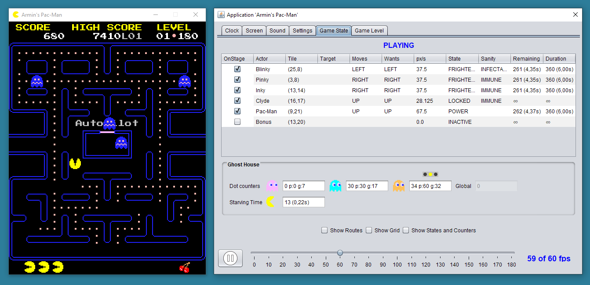](https://www.youtube.com/watch?v=JU3kmUC3T2k&t=210s)
(Click image to play video)

## Features

- CTRL+P pauses/resumes the game
- F2 opens a settings dialog where the game clock frequency and (full-)screen resolution can be changed
- F11 toggles between window and full-screen exclusive mode
- The settings dialog contains four custom tabs:
  1. Theme selection
  2. Running state machine inspection 
  3. Game and actor state inspection
  4. Level data inspection

General command-line arguments:
  - Scaling: e.g. `-scale 2.5`
  - Full-screen mode on start: `-fullScreenOnStart`
  - Full-screen resolution & depth: e.g. `-fullScreenMode 800,600,32`
  - Window title: e.g. `-title "Pac-Man Game"`
  - Muted: `-muted`
  - Antialiased rendering: `-smoothRendering`
  - Clock speed: e.g. `-fps 100`

Game-specific command-line arguments:
  - `-help`, `-usage`: list all available command-line parameters
  - `-demoMode` (default: false): Pac-Man moves automatically and is immortable
  - `-simpleMode` (default: false): in simple mode only the basic playing functionality is enabled
  - `-ghostsHarmless` (default: false): deadly ghost collisions are detected 
  - `-ghostsSafeCorner` (default: false): ghosts flee to safe corners and not randomly as in the original game
  - `-pacManImmortable` (default: false): Pac-Man keeps live after being killed
  - `-fixOverflowBug` (default: false): fix overflow bug from Arcade version
  - `-pathFinder` (default: astar): the path finder algorithm (astar, bfs, bestfs) used for computing the safe paths
  - `-skipIntro` (default: false): intro screen is skipped
  - `-startLevel` (default: 1): starts the game in the specified level
  - `-theme`: (default: arcade): used theme (arcade, blocks, ascii) 

In enhanced mode, the following additional features are available:
  - The overall speed can be changed during the game; 
    - Continuosly: CTRL-LEFT = slower, CTRL-RIGHT = faster
    - Fixed: '1' = normal speed, '2' = fast, '3' = very fast
  - 'b' toggles the presence of Blinky
  - 'c' toggles the presence of Clyde
  - 'd' toggles between normal play mode and demo mode where Pac-Man moves automatically and stays alive
  - 'e' eats all pellets except the energizers
  - 'f' toggles the ghost's *frightened* behavior between "random" (original) and "select safe corner"
  - 'g' toggles the display of the grid and the alignment of the actors on the grid
  - 'i' toggles the presence of Inky
  - 'k' kills all ghosts
  - 'l' toggles the tracing of the used state machines
  - 'm' makes Pac-Man immortable (does not lose live after being killed)
  - 'o' toggles the simulation of the overflow bug which occurs in the original Arcade game when Pac-Man is looking upwards
  - 'p' toggles the presence of Pinky
  - 'r' toggles the display of actor routes and target tiles
  - 's' toggles the display of actor states and timers
  - 't' toggles display of timing information (target vs. actual framerate)
  - 'x' toggles if ghost collisions kill Pac-Man or not
  - 'z' switches to the next available theme
  - '+' switches to the next level

## These were the times
  
The only computer game I played regularly was a Pac-Man clone named ["Snack Attack"](https://www.youtube.com/watch?v=ivAZkuBbpsM), running at the time (1984) on my Apple II+ clone, with a crappy tiny integrated speaker, attached to a low-res monochrome monitor, but this hypnotizing smacking sound is still in my head today!

When I discovered Pac-Man clone implementations on YouTube some years ago, I asked myself: how would I do that, as a software developer with a certain experience, but one who never has implemented a game before? 

I shortly looked into existing code, for example [here](https://github.com/leonardo-ono/Java2DPacmanGame) or [here](https://github.com/urossss/Pac-Man) which I didn't find too bad. I also found articles and blog posts talking about how the Pac-Man actors can be modelled by finite-state machines and how their individual behaviour ("AI") make this game so entertaining. But what I could not find anywhere was an implementation where these aspects were still cleary visible inside the code.

And so my challenge was born: 

*Can I implement a Pac-Man clone in such a way that the finite-state machines are explicitly visible inside the code?*

## Issues to solve

First, implementing a good representation of the maze and the correct movement of the game characters 
through the maze are not trivial. Pac-Man's movement direction is controlled by the keyboard and the intended move direction can be selected already before Pac-Man actually can turn to that direction. 

After having implemented this correctly, the next challenge is the logic and the control of the game itself. You have to sort out the different states of the game and the actors, you have to understand how the user interface should behave depending on the current state and which game "events" lead from one state to the other (state transitions).

Maybe you will start with a single ghost and implement its behavior: waiting (bouncing) in the ghost house, leaving the house to chase Pac-Man or scattering out to the ghost's maze corner. What should happen when Pac-Man and a ghost are colliding? 
Which part of your program should coordinate this? Should the code be distributed over the actors or should you have 
some kind of mediator, some central game control? Where should the game rules (points, lives, levels etc.) be implemented? 
Should this be placed in some kind of model in the sense of the Model-View-Controller pattern?

## Finite-state machines

There are many possibilities of implementing *finite-state machines* in software: from basic switch-statements, function pointers (C, C++) to object-oriented "state pattern"-based implementations. There are also ready-to-use libraries like [Appcelerate](http://www.appccelerate.com/), [Stateless4j](https://github.com/oxo42/stateless4j) or [Squirrel](http://hekailiang.github.io/squirrel/). What should you do? 

The low-level implementations using switch-statements or function pointers (if your programming language supports this) are the most performant ones but as long as you achieve the performance goals for your game (60 frames/updates per second) you can use whatever you like. Of course, using  a higher-level implementation should make your code more readable and easier to maintain.

I decided to write my own [state machine implementation](https://github.com/armin-reichert/statemachine), which was a good exercise and really fun because of the availability of lambda expressions and method references. These state machines can be exported into the [Graphviz](https://graphviz.org) format which is also used to display the running state machines inside the inspection view.

After you have decided which implementation you want to use for your state machines you can finally focus on the game itself.

Which entities in the Pac-Man game are candidates for getting controlled by state machines?

Of course, Pac-Man and the four ghosts, but also the global game control, maybe also the screen selection logic or even simpler entities in your game. It is interesting to look at your program parts through the state machine glasses and find out where an explicit state machine becomes useful.

All state machines in this implementation are implemented in a declarative way (*builder pattern*). A single large Java expression defines the complete state graph together with node and edge annotations representing the actions, conditions, event conditions and timers. Lambda expressions (anonymous functions) and function references allow to embed code directly inside the state machine definition. If the state definition becomes more complex it is possible to implement it in a separate state class. Both variants are used here.

## State machines in action

Sounds well and nice, but how does that look in the real code? 

To give a first example, consider the **intro screen** ([IntroView](PacManGame/src/main/java/de/amr/games/pacman/view/intro/IntroView.java)) which shows different animations coordinated using timers and conditions. 


As this state machine only uses timers and no other events, *Void* is specified as event type. The states are identified by an enumeration type.

```java
public enum IntroState {
	SCROLLING_LOGO_ANIMATION, CHASING_ANIMATIONS, WAITING_FOR_INPUT, READY_TO_PLAY
};
...

beginStateMachine()
	.description("IntroView")
	.initialState(SCROLLING_LOGO_ANIMATION)
	.states()

		.state(SCROLLING_LOGO_ANIMATION)
			.customState(new ScrollingLogoAnimation())

		.state(CHASING_ANIMATIONS)
			.customState(new ChasingAnimation())

		.state(WAITING_FOR_INPUT)
			.customState(new WaitingForInput())
			.timeoutAfter(sec(15))

		.state(READY_TO_PLAY)

	.transitions()

		.when(SCROLLING_LOGO_ANIMATION).then(CHASING_ANIMATIONS)
			.condition(() -> pacManLogo.isComplete())
			.annotation("Pac-Man logo at top")

		.when(CHASING_ANIMATIONS).then(WAITING_FOR_INPUT)
			.condition(() -> chasePacMan.isComplete() && chaseGhosts.isComplete())
			.annotation("Chasing animations complete")

		.when(WAITING_FOR_INPUT).then(CHASING_ANIMATIONS)
			.onTimeout()

		.when(WAITING_FOR_INPUT).then(READY_TO_PLAY)
			.condition(() -> Keyboard.keyPressedOnce("space"))
			.annotation("SPACE pressed")

.endStateMachine();
```

The states in this case are implemented as separate (inner) classes instead of inlined in the state machine builder expression. The reason is that each state has its own visualization which is implemented in its own draw method. Otherwise, the draw method of the intro view class would have to dispatch again depending on the current state.

A more complex state machine is used for implementing the **global game controller** ([GameController](PacManGame/src/main/java/de/amr/games/pacman/controller/game/GameController.java)).


It processes game events which are created during the game play, for example when Pac-Man finds food or meets ghosts. Also the different
game states like changing the level or the dying animations of Pac-Man and the ghosts are controlled by this
state machine. Further, the more complex states are implemented as subclasses of the generic `State` class. This
has the advantage that actions which are state-specific can be realized as methods of the state subclass.

The **ghost attack waves** (scattering, chasing) with their level-specific timing are realized by the following state machine:


See [GhostCommand](PacManGame/src/main/java/de/amr/games/pacman/controller/game/GhostCommand.java)

```java
beginStateMachine()
	.description("Ghost Attack Controller")
	.initialState(SCATTER)
.states()
	.state(SCATTER)
		.timeoutAfter(() -> times(game.level.number).scatter)
		.onTick(this::notifyGhosts)
		.annotation(() -> "Round " + round)
	.state(CHASE)
		.timeoutAfter(() -> times(game.level.number).chase)
		.onTick(this::notifyGhosts)
		.annotation(() -> "Round " + round)
	.state(PAUSED)
.transitions()
	.when(SCATTER).then(CHASE).onTimeout()
	.when(SCATTER).then(PAUSED).on("Pause").act(() -> pausedState = getState())
	.when(CHASE).then(SCATTER).onTimeout().act(() -> ++round)
	.when(CHASE).then(PAUSED).on("Pause").act(() -> pausedState = getState())
.endStateMachine();
```

The actors are also controlled by several finite-state machines.

- **Pac-Man** ([Pac-Man](PacManGame/src/main/java/de/amr/games/pacman/controller/creatures/pacman/PacMan.java))

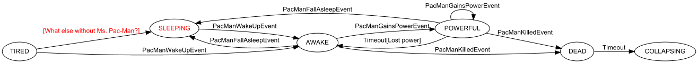

Each ghost has a state machine controlling its "AI" and a two-state machine controlling its moving (normal movement vs. teleportation mode). The ghost named "Blinky" has an additional state machine controlling its "mental state", see below.

- **Ghosts** ([Ghost](PacManGame/src/main/java/de/amr/games/pacman/controller/creatures/ghost/Ghost.java)) 


Also the lifetime of simple entities like the **bonus symbol** ([Bonus](PacManGame/src/main/java/de/amr/games/pacman/controller/bonus/BonusFoodController.java)) which appears at certain scores is controlled by a finite-state machine:


```java
beginStateMachine()
	.description("Bonus Food Controller")
	.initialState(BONUS_INACTIVE)
	.states()

		.state(BONUS_INACTIVE)
			.onEntry(world::hideTemporaryFood)

		.state(BONUS_CONSUMABLE)
			.timeoutAfter(fnActivationTime)
			.onEntry(() -> activateBonus(world))

		.state(BONUS_CONSUMED).timeoutAfter(Timing.sec(3))

	.transitions()

		.when(BONUS_CONSUMABLE).then(BONUS_CONSUMED).on(BonusFoundEvent.class)
			.act(() -> consumeBonus(world))

		.when(BONUS_CONSUMABLE).then(BONUS_INACTIVE).onTimeout()
			.act(() -> deactivateBonus(world))

		.when(BONUS_CONSUMED).then(BONUS_INACTIVE).onTimeout()

.endStateMachine();
```

When an actor leaves the board inside a tunnel it leaves its normal movement mode and enters *teleporting* mode. The [movement](PacManGame/src/main/java/de/amr/games/pacman/controller/steering/common/Movement.java) of the actors is controlled by the following state machine:


```java
beginStateMachine()
	.description(description)
	.initialState(WALKING)
	.states()
		.state(WALKING)
			.onTick(this::move)
		.state(TELEPORTING)
			.timeoutAfter(sec(1.0f))
			.onEntry(() -> mover.setVisible(false))
			.onExit(() -> mover.setVisible(true))
	.transitions()
		.when(WALKING).then(TELEPORTING)
			.condition(this::hasEnteredPortal)
			.annotation("Enters portal")
		.when(TELEPORTING).then(WALKING)
			.onTimeout()
			.act(this::teleport)
			.annotation("Teleporting")
.endStateMachine();
```

## Tracing

The processing of all used state machines can be traced. If a state machine processes an event and does not 
find a suitable state transition, a runtime exception is thrown by default. This is very useful for finding 
gaps in the state machine definition in the development stage. Afterwards, this behavior can be changed so
that only a message is logged for unhandled events. This avoids the need for specifying "empty" transitions
for any event that has no effect in the current state.

## Pac-Man steering

Pac-Man is steered by holding a key indicating its **intended** direction. As soon as Pac-Man reaches a tile 
where it can move towards this direction it changes its move direction accordingly. ("Cornering" is not yet implemented). 
In the code, this is implemented by setting the steering function as shown below. This makes it very easy 
to replace the manual steering by some sort of automatic steering ("AI"):

```java
you(pacMan).followTheKeys().keys(VK_UP, VK_RIGHT, VK_DOWN, VK_LEFT).ok();
```

## Ghost steering ("AI")

What makes the game so entertaining is the individual behavior of each ghost when chasing Pac-Man. The red ghost (Blinky) attacks Pac-Man directly, the pink ghost (Pinky) tries to ambush Pac-Man, the orange ghost (Clyde) either attacks directly or rejects, depending on its distance to Pac-Man, and the cyan ghost (Inky) uses Blinky's current position to get in Pac-Man's way. 

To realize these different ghost behaviors each ghost has a map of functions mapping her state (*scattering*, *chasing*, *frightened*, ...) to the corresponding behavior implementation. In terms of OO design patterns, one could call this a *strategy pattern*. 

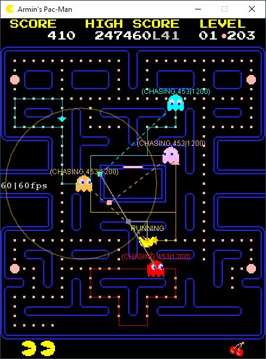

The ghost behavior only differs for the *chasing* state namely in the logic for calculating the target tile. Beside the different target tiles, the ghost behavior is equal. Each ghost uses the same algorithm to calculate the next move direction to take for reaching the target tile as described in the references given at the end of this article.

The *frightened* behavior has two different implementations (just as a demonstration how the behavior can be exchanged during the game) and can be toggled for all ghosts at once by pressing the 'f'-key.

### Common ghost behavior

The common behavior of all ghosts is defined by the following code:

```java
ghosts().forEach(ghost -> {
	you(ghost).when(LOCKED).bounceOnBed().ok();
	you(ghost).when(ENTERING_HOUSE).enterHouseAndGoToBed().ok();
	you(ghost).when(LEAVING_HOUSE).leaveHouse().house(house).ok();
	you(ghost).when(FRIGHTENED).moveRandomly().ok();
	you(ghost).when(DEAD).headFor().tile(houseEntry).ok();
});
```
The only difference in ghost behavior are the target tiles in the "CHASING" and "SCATTERING" state and the beds where the ghosts start and return when dead.

### Scattering

In *scattering* state, each ghost tries to reach his individual "scattering target". These are unreachable tiles outside of the playing area. Because ghosts cannot reverse their move direction, this results in a cyclic movement in the corresponding maze corner.

```java
you(blinky).when(SCATTERING).headFor().tile(world.width() - 3, 0).ok();
you(inky).when(SCATTERING).headFor().tile(world.width() - 1, world.height() - 1).ok();
you(pinky).when(SCATTERING).headFor().tile(2, 0).ok();
you(clyde).when(SCATTERING).headFor().tile(0, world.height() - 1).ok();
```

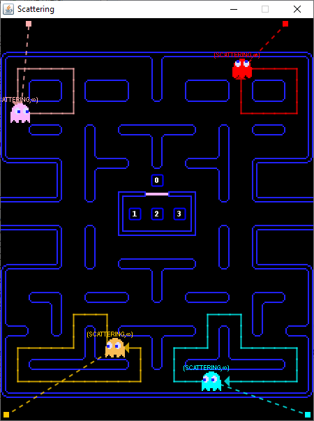

### Chasing

#### Blinky (the red ghost)

Blinky is special because he becomes "Cruise Elroy" when the number of remaining pellets reaches certain values, depending on the current game level. He then 
chases Pac-Man also in SCATTERING state and increases his speed. When Pac-Man gets killed, this behavior is suspended until Clyde has left the ghosthouse.

This behavior is implemented by the following state machine:


```java
beginStateMachine()
	.initialState(HEALTHY)
	.description(() -> String.format("Ghost %s Madness", ghost.name))
	.states()

		.state(HEALTHY).onEntry(this::targetCorner)

		.state(ELROY1).onEntry(this::targetPacMan)

		.state(ELROY2).onEntry(this::targetPacMan)

		.state(SUSPENDED).onEntry(this::targetCorner)

	.transitions()

		.when(HEALTHY).then(ELROY2)
			.condition(this::reachedElroy2Score)
			.annotation(() -> String.format("Pellets left <= %d", game.level.elroy2DotsLeft))

		.when(HEALTHY).then(ELROY1)
			.condition(this::reachedElroy1Score)
			.annotation(() -> String.format("Pellets left <= %d", game.level.elroy1DotsLeft))

		.when(SUSPENDED).then(ELROY2)
			.on(CLYDE_EXITS_HOUSE)
			.condition(this::reachedElroy2Score)
			.annotation("Become Elroy again when Clyde exits house")

		.when(SUSPENDED).then(ELROY1)
			.on(CLYDE_EXITS_HOUSE)
			.condition(this::reachedElroy1Score)
			.annotation("Become Elroy again when Clyde exits house")

		.when(ELROY1).then(ELROY2)
			.condition(this::reachedElroy2Score)
			.annotation(() -> String.format("Remaining pellets <= %d", game.level.elroy2DotsLeft))

		.when(ELROY1).then(SUSPENDED).on(PACMAN_DIES)
			.annotation("Suspend Elroy when Pac-Man dies")

		.when(ELROY2).then(SUSPENDED).on(PACMAN_DIES)
			.annotation("Suspend Elroy when Pac-Man dies")

.endStateMachine();
```

See class [GhostMadnessController](PacManGame/src/main/java/de/amr/games/pacman/controller/creatures/ghost/GhostMadnessController.java)


Blinky's chasing behavior is to directly attack Pac-Man. 

```java
you(blinky).when(CHASING).headFor().tile(pacMan::location).ok();
```


#### Pinky

Pinky, the *ambusher*, heads for the position 4 tiles ahead of Pac-Man's current position. In the original game there is an overflow error leading to a different behavior: when Pac-Man looks upwards, the tile ahead of Pac-Man is falsely computed with an additional number of steps to the west. This behavior is active by default and can be toggled using the 'o'-key.

```java
you(pinky).when(CHASING).headFor().tile(() -> pacMan.tilesAhead(4)).ok();
```

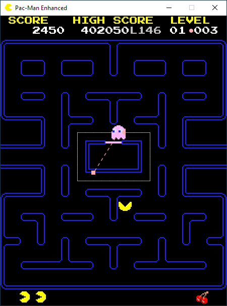

#### Inky (the cyan ghost)

Inky heads for a position that depends on Blinky's current position and the position two tiles ahead of Pac-Man:

Consider the vector `V` from Blinky's position `B` to the position `P` two tiles ahead of Pac-Man, so `V = (P - B)`. 
Add the doubled vector to Blinky's position: `B + 2 * (P - B) = 2 * P - B` to get Inky's target:

```java
you(inky).when(CHASING).headFor().tile(() -> {
	Tile b = blinky.location(), p = pacMan.tilesAhead(2);
	return Tile.at(2 * p.col - b.col, 2 * p.row - b.row);
}).ok();
```

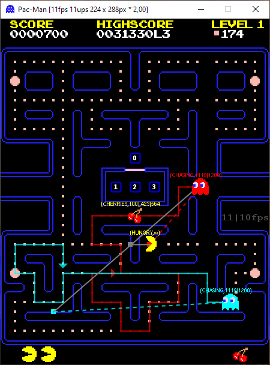

#### Clyde (the orange ghost)

Clyde attacks Pac-Man directly (like Blinky) if his straight line distance from Pac-Man is more than 8 tiles. If closer, he behaves like in scattering mode.

```java
you(clyde).when(CHASING).headFor()
	.tile(() -> clyde.distance(pacMan) > 8 ? pacMan.location() : Tile.at(0, worldHeight - 1)).ok();
```

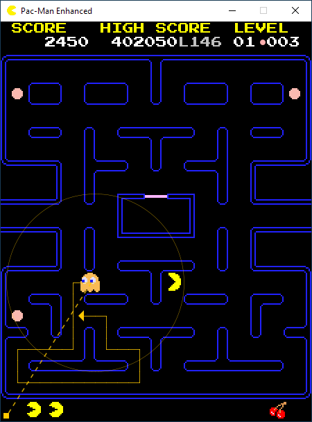

For details, see class [Folks](PacManGame/src/main/java/de/amr/games/pacman/controller/creatures/Folks.java).

### Visualization of attack behavior

The visualization of the ghost attack behavior i.e. the routes to their current target tile can be activated during the game by pressing the 'r'-key ("show/hide routes").

### Visualization of game state

There are two ways of getting information about the current game and actor state: either inside the playing view where state names and timer values are displayed at the actors themselves, or in the application settings dialog that can be opened using the F2-key. An application can add its own  tabs to this dialog using the Application API. In the Pac-Man game, there are two custom tabs:

#### "State Machines" tab

The currently running state machines are displayed in Graphviz dot-format and rendered as an image which is live updated as the game is running. The tree on the left side shows all currently active state machines. Double-clicking an entry, opens the graphical display in a new window. You can zoom in/out using the '+'/'-' keys. The graphs can also be saved in "dot"-format and opened in the GraphvizOnline website, where they can be converted to other formats.

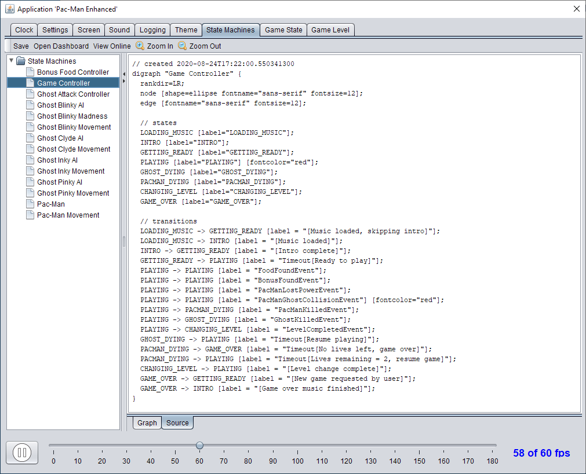

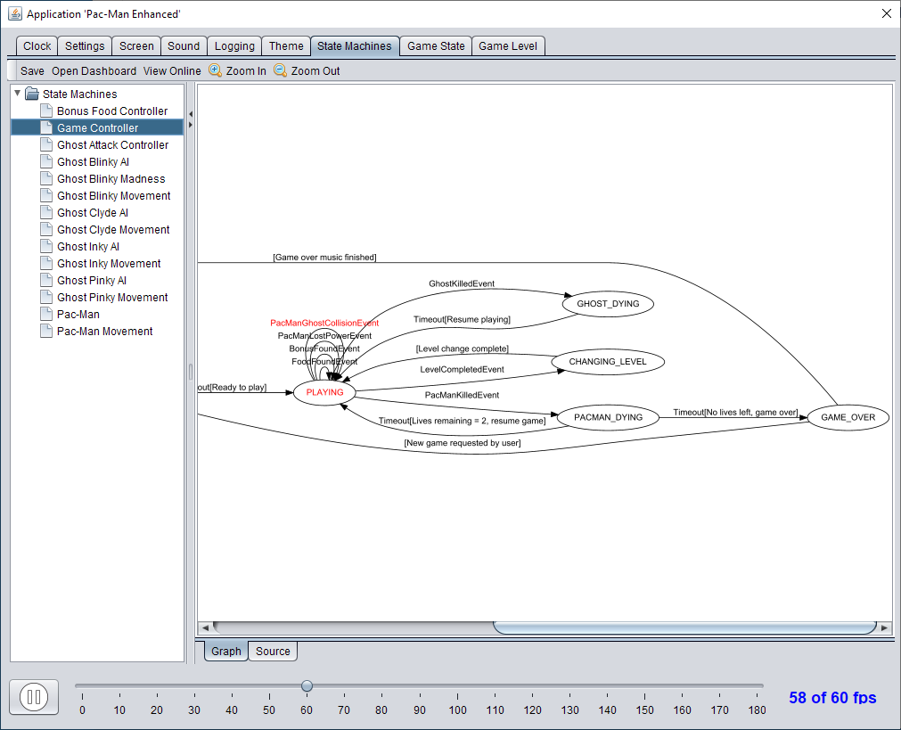

#### "Game State" tab

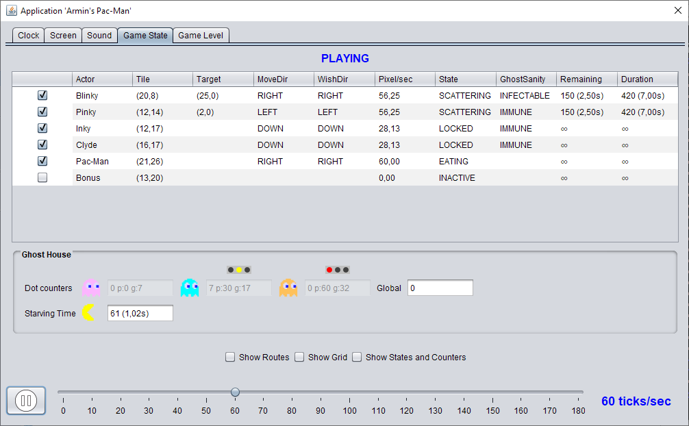

The table shows the current state of all actors in the game and also their velocities and positions. The traffic lights show when ghosts locked inside the ghost house
are allowed to leave (following the rules described in the references cited below).

#### "Game Level" tab

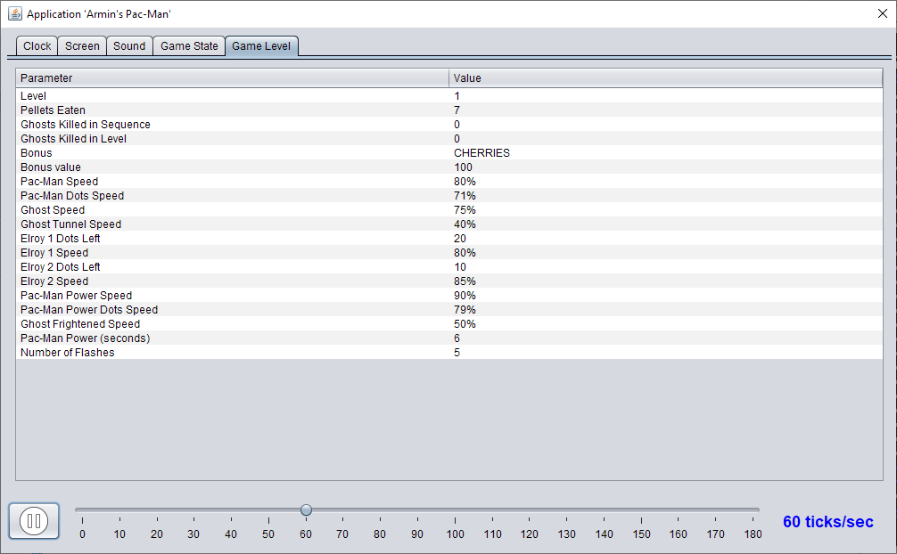

## Graph-based pathfinding

The original Pac-Man game did not use any graph-based pathfinding. To still give an example how graph-based pathfinding can be useful, there is an additional implementation of the *frightened* behavior: when Pac-Man eats a power-pill each frightened ghost choses the "safest" corner to flee to. It computes the shortest path to each corner and selects the one with the largest distance to Pac-Man's current position. Here, the distance of a path from Pac-Man's position is defined as the minimum distance of any tile on the path from Pac-Man's position. The code to set this behavior for a ghost reads as:

```java
ghost.setSteering(FRIGHTENED, new FleeingToSafeTile(ghost, ghost.pacMan));
```

The wrapper class [WorldGraph](PacManGameEnhanced/src/main/java/de/amr/games/pacman/model/world/graph/WorldGraph.java) adds a (grid) graph structure to the maze. This allows running the generic graph algorithms from my [graph library](https://github.com/armin-reichert/graph) on the maze. For example, shortest paths in the maze can then be computed by just calling the *findPath(Tile source, Tile target)* method on the maze graph. This method runs either an [A* search](http://theory.stanford.edu/~amitp/GameProgramming/AStarComparison.html), a Breadth-First Search or a Best-First Search on the underlying graph, see configuration options below. The graph library provides a whole number of search algorithms like BFS or Dijkstra. The code to compute a shortest path between two tiles using the A* algorithm with Manhattan distance heuristics looks like this:

```java
GraphSearch pathfinder = new AStarSearch(grid, (u, v) -> 1, grid::manhattan);
Path path = pathfinder.findPath(vertex(source), vertex(target));
```
However, for a graph of such a small size, the used algorithm doesn't matter very much, a Breadth-First Search would also run with sufficient performance in this use case.

## Theming support

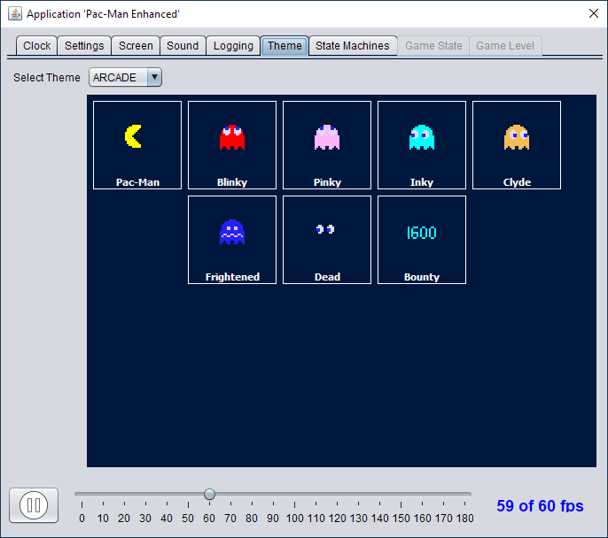

The view layer supports theming. The currently implemented themes are 

- ARCADE: uses sprites as in the original Arcade game

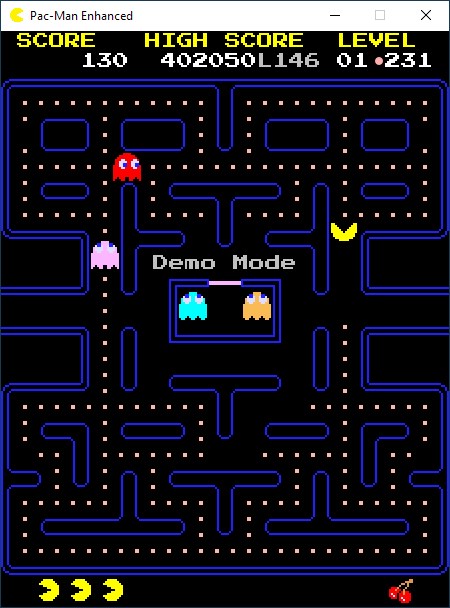

- BLOCKS: a theme using simple geometric shapes

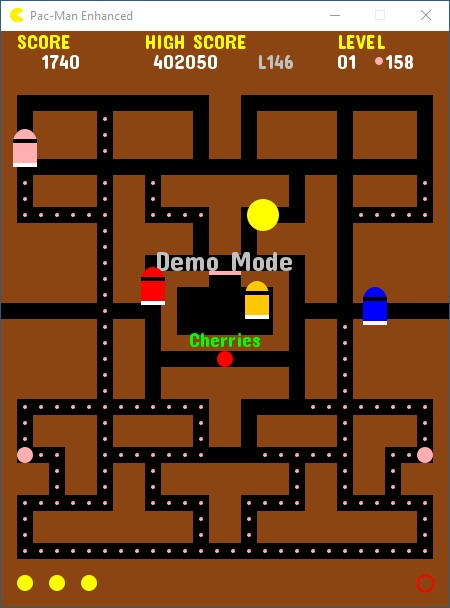

- LETTERS: a theme using letters

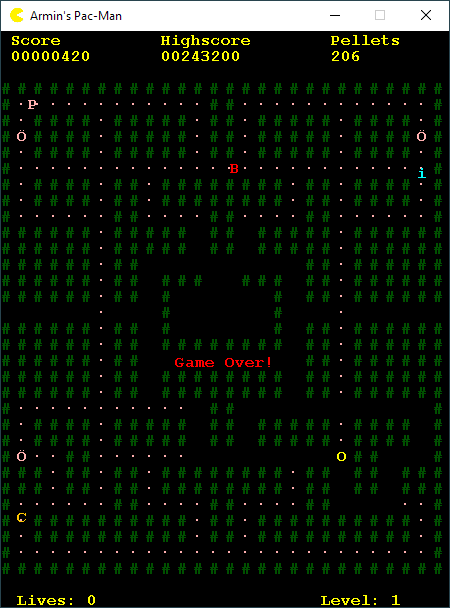

Themes can be switched during the game by pressing the "z" key.

## References

This work would not have been possible without these invaluable sources of information:

- [GameInternals - Understanding Pac-Man Ghost Behavior](http://gameinternals.com/post/2072558330/understanding-pac-man-ghost-behavior)
- [Gamasutra - The Pac-Man Dossier](http://www.gamasutra.com/view/feature/3938/the_pacman_dossier.php)

Just recently I found this excellent video on YouTube:

- [Pac-Man ghost AI explained](https://www.youtube.com/watch?v=ataGotQ7ir8)

## Summary

The goal of this project was to provide a [Pac-Man](https://en.wikipedia.org/wiki/List_of_Pac-Man_video_games) implementation in which the game's inner workings can be understood from the code more easily. The implementation follows the MVC pattern and uses finite-state machines for the control logic of the actors and the game. The state machines are implemented in a declarative way using the *builder* pattern. 

A home-brew library is used for the basic game infrastructure (active rendering, game loop, full-screen mode, 
keyboard and mouse handling etc.), but it should be no problem to implement these parts from scratch or 
use some real game library instead.

*Armin Reichert, July 2020*
